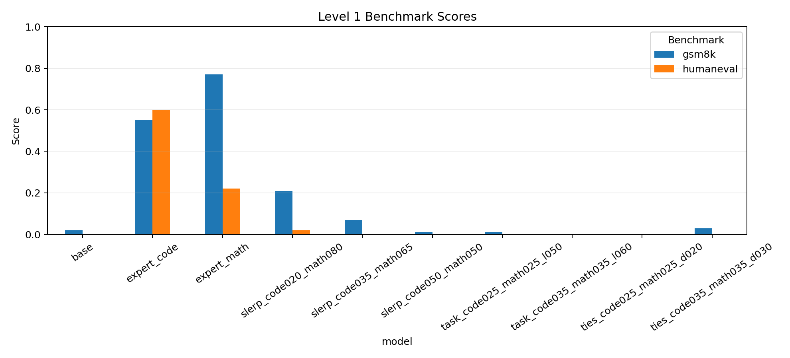
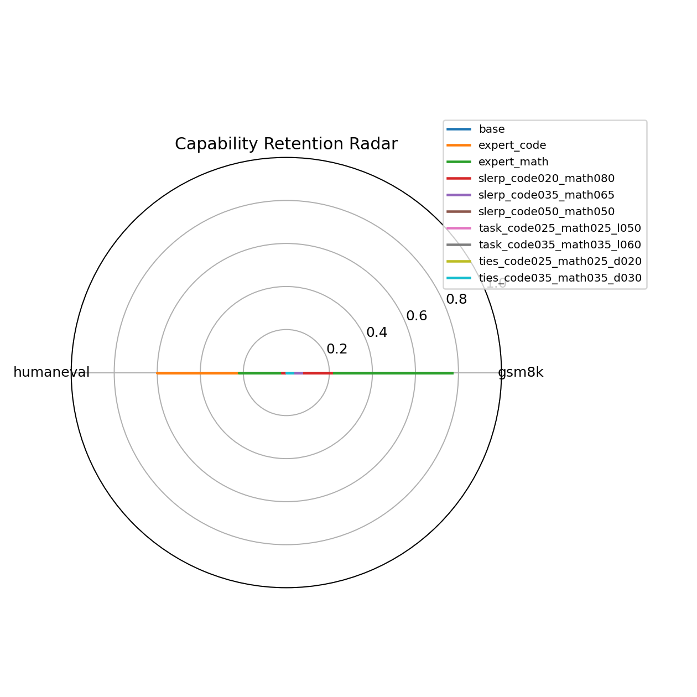
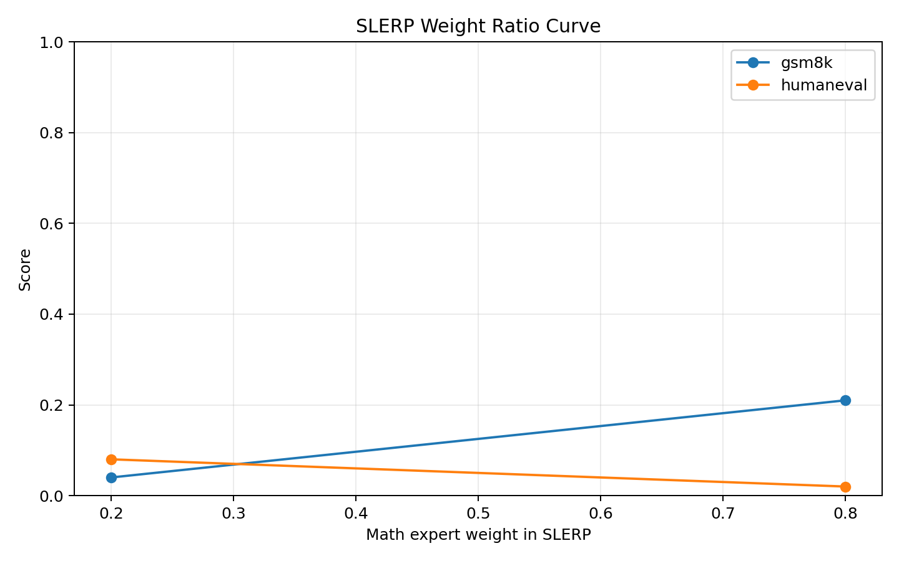
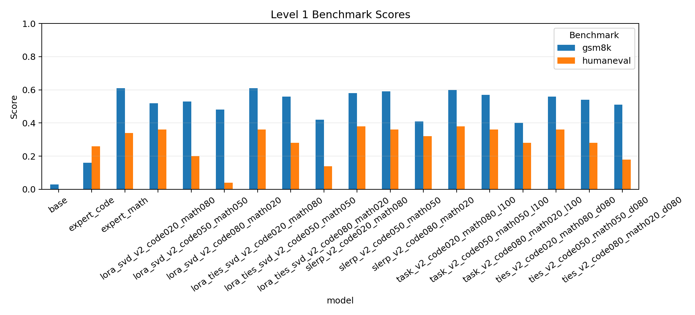
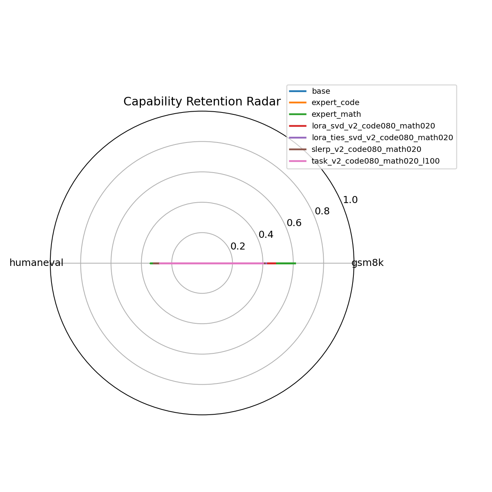
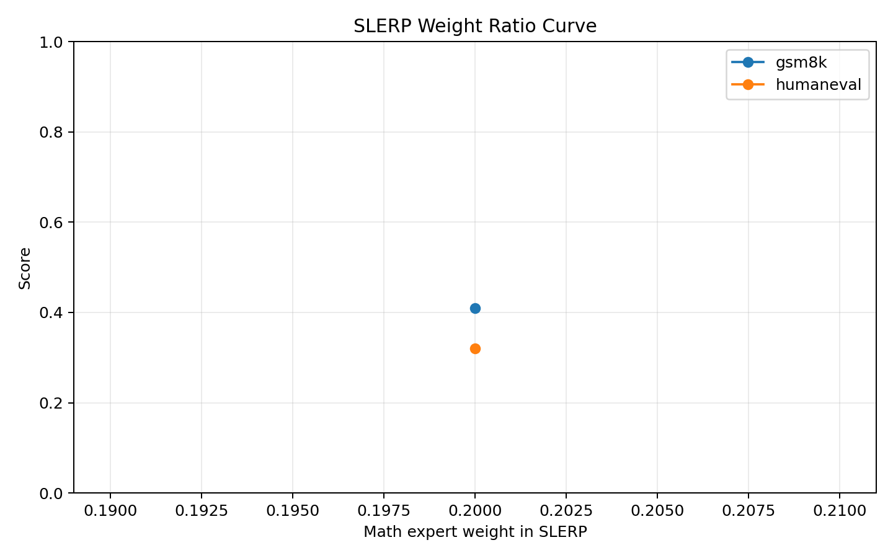
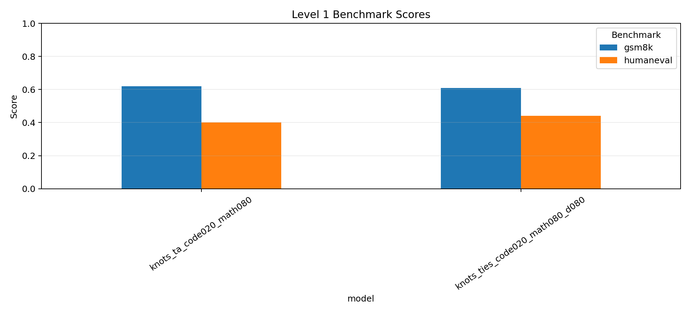
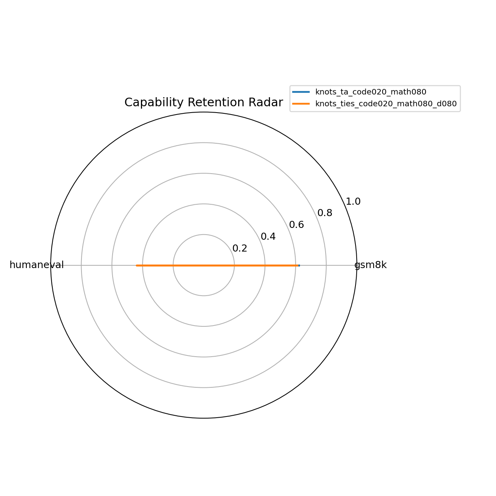

# Model Merging 实验报告：Level 1 + Level 2

## 1. 项目目标

本项目围绕课程主题“Model Merging / 模型合并与知识复用”展开，已完成 Level 1 和 Level 2 两部分。

Level 1 要求选择两个能力方向不同的专家模型，例如 code expert 和 math expert，在两个专家擅长的 benchmark 上分别评测，并验证融合后的模型相较基座模型是否有显著提升，同时分析不同融合算法的优劣。

Level 2 要求复现一篇 2024-2026 年顶会或 arXiv 上的模型合并相关论文，要求跑通开源代码，或根据论文公式自己实现核心合并逻辑，并在至少一个数据集上复现论文报告的性能。

本实验最终保留两条主线：

1. 官方专家模型主线：以 `Qwen/Qwen2.5-1.5B` 为基座参考，使用 `Qwen/Qwen2.5-Coder-1.5B-Instruct` 和 `Qwen/Qwen2.5-Math-1.5B-Instruct` 作为专家模型，探索直接 full-model merging 的效果。
2. 自训练 LoRA v2 主线：以 `Qwen/Qwen2.5-1.5B` 为严格共同基座，分别训练 math LoRA 和 code LoRA，再物化专家模型并进行多种合并算法搜索。该主线是本报告的最终结论主线。
3. Level 2 前沿复现主线：选择 ICLR 2025 论文 `Model merging with SVD to tie the KnOTS`，根据论文核心公式实现 KnOTS 风格的 SVD 对齐 LoRA 合并，并在 GSM8K 和 HumanEval 上验证其性能。

## 2. 实验环境与评测设置

### 2.1 硬件与环境

- 操作系统：Windows
- GPU：NVIDIA GeForce RTX 4060 Laptop GPU，8GB 显存
- Conda 环境：`IntroML`
- Level 1 项目目录：`D:\IntroML\project\level1_model_merging`
- Level 2 项目目录：`D:\IntroML\project\level2_knots`
- Hugging Face 缓存：`D:\IntroML\project\hf_cache`

### 2.2 Benchmark

本实验使用两个任务进行评测：

| Benchmark | 能力方向 | 指标 | 评测规模 |
|---|---|---|---:|
| GSM8K | 数学推理 | accuracy | 100 |
| HumanEval | Python 代码生成 | pass@1 | 50 |

HumanEval 的 pass@1 通过执行生成代码并运行测试用例计算。评测脚本支持 JSONL 增量写入与断点续跑，避免长时间评测中断后重跑全部样本。

### 2.3 关键代码修复

为了保证评测可信，本项目对评测代码做了以下修复：

- HumanEval fenced code 解析：支持去除 markdown code fence。
- HumanEval pass@1：不只判断语法，而是执行测试用例。
- GSM8K prompt：要求模型最后一行输出 `#### <number>`。
- GSM8K 答案抽取：支持从生成文本中抽取最终数字。
- `numeric_equal`：修复极端数字导致的 `OverflowError`。
- 增量评测：添加 JSONL 增量写入和断点续跑。
- `--skip-existing`：避免重复评测已有结果。

## 3. 实验探索过程

### 3.1 早期结果丢弃

最早的 `results` 目录结果使用了错误 base 模型，因此不作为最终分析依据。后续有效结果主要来自：

- `results_improved`：官方 Qwen Coder/Math 专家模型主线。
- `results_trained_lora_v2`：自训练 LoRA v2 主线。

### 3.2 官方专家模型主线

该主线使用：

- base：`Qwen/Qwen2.5-1.5B`
- code expert：`Qwen/Qwen2.5-Coder-1.5B-Instruct`
- math expert：`Qwen/Qwen2.5-Math-1.5B-Instruct`

结果文件：

- `results_improved/results_summary.csv`
- `results_improved/plots/bar_accuracy.png`
- `results_improved/plots/radar_accuracy.png`
- `results_improved/plots/slerp_weight_curve.png`

#### 3.2.1 结果表

| model | GSM8K accuracy | HumanEval pass@1 |
|---|---:|---:|
| base | 0.02 | 0.00 |
| expert_code | 0.55 | 0.60 |
| expert_math | 0.77 | 0.22 |
| slerp_code020_math080 | 0.21 | 0.02 |
| slerp_code080_math020 | 0.04 | 0.08 |
| task_code080_math020_l100 | 0.08 | 0.02 |
| ties_code080_math020_d080 | 0.00 | 0.00 |

#### 3.2.2 图表







#### 3.2.3 分析

官方专家模型本身非常强：

- `expert_math` 在 GSM8K 上从 base 的 0.02 提升到 0.77。
- `expert_code` 在 HumanEval 上从 base 的 0.00 提升到 0.60。

但是直接合并后的模型提升不够显著。表现最好的合并模型是 `slerp_code020_math080`，GSM8K 达到 0.21，HumanEval 达到 0.02；虽然两个任务都高于 base，但 HumanEval 只多通过 1 道题，提升较弱。`slerp_code080_math020` 在 HumanEval 上达到 0.08，但 GSM8K 只有 0.04。Task Arithmetic 和 TIES 在该主线下整体更弱。

主要原因可能是：

1. 官方 Coder/Math 专家虽然模型结构兼容，但训练目标、指令对齐方式和任务分布差异较大。
2. Instruct / Math / Coder 模型之间存在较强参数冲突。
3. Task Arithmetic 和 TIES 依赖“同一 base 的任务向量”假设更强；如果专家并非严格由同一 base 以同类方式微调而来，合并效果容易退化。

因此，该主线可以作为“专家模型强，但直接 full-model merge 不稳定”的实验探索。

## 4. 自训练 LoRA v2 主线

### 4.1 动机

官方专家直接合并不够理想后，本实验转向更符合模型合并假设的方案：在同一个基座 `Qwen/Qwen2.5-1.5B` 上训练两个 LoRA 专家。

v1 自训练 LoRA 曾出现效果不佳，主要原因是训练数据形式和评测 prompt 不一致：

- math LoRA 的训练 prompt 没有严格对齐 GSM8K eval prompt。
- code LoRA 使用泛化的 Python instruction 数据，而不是 HumanEval 风格的函数体补全数据。

v2 做了三项关键修正：

1. math 训练 prompt 对齐当前 GSM8K eval prompt，强制最后一行输出 `#### <number>`。
2. code 训练数据改为 MBPP/HumanEval 风格的“给定函数签名，补全函数体”。
3. 学习率降低到 `5e-5`，减少低资源训练中的格式漂移和灾难性遗忘。

### 4.2 训练设置

配置文件：`configs/train_lora_v2_experiment.yaml`

| expert | 数据集 | 训练样本 | epoch | 学习率 | LoRA rank |
|---|---|---:|---:|---:|---:|
| math LoRA | `openai/gsm8k` | 3000 | 2 | 5e-5 | 16 |
| code LoRA | `google-research-datasets/mbpp` | 974 | 5 | 5e-5 | 16 |

code 数据使用 `google-research-datasets/mbpp` 的 `full` 配置，并使用 `train+validation+prompt+test`。最终评测在 HumanEval 上进行，因此不存在直接使用 HumanEval 测试集训练的问题。

### 4.3 合并算法搜索

v2 主线补齐了三档权重：

- code/math = 80/20
- code/math = 50/50
- code/math = 20/80

完成的合并算法包括：

| 类别 | 算法/方法 | 说明 |
|---|---|---|
| full-model merge | SLERP | 对两个专家权重做球面插值 |
| full-model merge | Task Arithmetic | 基于 base + 加权 task vector |
| full-model merge | TIES | 对 task vector 做裁剪、符号一致性处理和稀疏合并 |
| adapter merge | LoRA SVD | 先在 adapter 层做 SVD 加权合并，再物化 |
| adapter merge | LoRA TIES-SVD | 在 adapter 层结合 TIES 和 SVD |

结果文件：

- `results_trained_lora_v2/results_summary.csv`
- `results_trained_lora_v2/plots/bar_accuracy.png`
- `results_trained_lora_v2/plots/radar_accuracy.png`
- `results_trained_lora_v2/plots/slerp_weight_curve.png`

### 4.4 完整结果表

| model | GSM8K accuracy | HumanEval pass@1 |
|---|---:|---:|
| base | 0.03 | 0.00 |
| expert_code | 0.16 | 0.26 |
| expert_math | 0.61 | 0.34 |
| slerp_v2_code080_math020 | 0.41 | 0.32 |
| slerp_v2_code050_math050 | 0.59 | 0.36 |
| slerp_v2_code020_math080 | 0.58 | 0.38 |
| task_v2_code080_math020_l100 | 0.40 | 0.28 |
| task_v2_code050_math050_l100 | 0.57 | 0.36 |
| task_v2_code020_math080_l100 | 0.60 | 0.38 |
| ties_v2_code080_math020_d080 | 0.51 | 0.18 |
| ties_v2_code050_math050_d080 | 0.54 | 0.28 |
| ties_v2_code020_math080_d080 | 0.56 | 0.36 |
| lora_svd_v2_code080_math020 | 0.48 | 0.04 |
| lora_svd_v2_code050_math050 | 0.53 | 0.20 |
| lora_svd_v2_code020_math080 | 0.52 | 0.36 |
| lora_ties_svd_v2_code080_math020 | 0.42 | 0.14 |
| lora_ties_svd_v2_code050_math050 | 0.56 | 0.28 |
| lora_ties_svd_v2_code020_math080 | 0.61 | 0.36 |

### 4.5 图表







## 5. 不同融合算法的优劣分析

### 5.1 SLERP

SLERP 在 v2 主线中表现非常稳定。三个权重下的结果为：

| model | GSM8K | HumanEval |
|---|---:|---:|
| slerp_v2_code080_math020 | 0.41 | 0.32 |
| slerp_v2_code050_math050 | 0.59 | 0.36 |
| slerp_v2_code020_math080 | 0.58 | 0.38 |

优点：

- 对权重空间插值较平滑，冲突较小。
- 在本实验中 50/50 和 20/80 都能同时保留数学和代码能力。
- 相比官方专家主线，v2 中 SLERP 明显受益于“同一 base + prompt 对齐 LoRA 专家”的设置。

缺点：

- 主要适合两个模型之间插值，扩展到多个专家时不如 task vector 方法直观。
- 插值权重不直接等价于“任务能力贡献”，解释性略弱。

结论：SLERP 是稳定可靠的 baseline。最佳 SLERP 模型为 `slerp_v2_code020_math080`，GSM8K 0.58，HumanEval 0.38。

### 5.2 Task Arithmetic

Task Arithmetic 在 v2 主线中取得最佳综合结果：

| model | GSM8K | HumanEval |
|---|---:|---:|
| task_v2_code080_math020_l100 | 0.40 | 0.28 |
| task_v2_code050_math050_l100 | 0.57 | 0.36 |
| task_v2_code020_math080_l100 | 0.60 | 0.38 |

优点：

- 原理清晰：将专家模型看作 base 加上任务向量，再加权组合任务向量。
- 在严格同 base 的 LoRA v2 设置下效果很好。
- 本实验最佳模型 `task_v2_code020_math080_l100` 来自 Task Arithmetic，说明非 SLERP 算法也能显著提升两个任务。

缺点：

- 对“专家是否来自同一 base”非常敏感。
- 在官方专家主线中效果较差，说明如果 task vector 不够干净，直接相加可能放大冲突。
- 需要搜索权重和 `lambda`，否则容易欠融合或过融合。

结论：Task Arithmetic 是本实验最终推荐方法。最佳模型 `task_v2_code020_math080_l100` 的 GSM8K 为 0.60，HumanEval 为 0.38。

### 5.3 TIES

full-weight TIES 的结果为：

| model | GSM8K | HumanEval |
|---|---:|---:|
| ties_v2_code080_math020_d080 | 0.51 | 0.18 |
| ties_v2_code050_math050_d080 | 0.54 | 0.28 |
| ties_v2_code020_math080_d080 | 0.56 | 0.36 |

优点：

- 通过裁剪和符号一致性处理缓解任务向量冲突。
- 在 20/80 权重下明显优于 base，说明 TIES 可以有效保留多任务能力。

缺点：

- 对 density 和权重较敏感。
- 在本实验中整体略弱于 SLERP 和 Task Arithmetic。
- code-heavy 权重下 HumanEval 只有 0.18，说明稀疏化可能剪掉了部分代码能力相关参数。

结论：TIES 能完成显著提升目标，但在本实验中不是最佳；它适合作为冲突缓解方法进行对比分析。

### 5.4 LoRA SVD

LoRA SVD 在 adapter 层合并后再物化模型：

| model | GSM8K | HumanEval |
|---|---:|---:|
| lora_svd_v2_code080_math020 | 0.48 | 0.04 |
| lora_svd_v2_code050_math050 | 0.53 | 0.20 |
| lora_svd_v2_code020_math080 | 0.52 | 0.36 |

优点：

- 可以在 adapter 层合并，存储和实验管理更灵活。
- math-heavy 权重下也能得到较强代码保留。

缺点：

- SVD rank 会形成信息瓶颈。
- code-heavy 权重下 HumanEval 只有 0.04，说明 adapter SVD 的压缩方向不一定保留代码能力。

结论：LoRA SVD 对权重很敏感，适合作为 adapter-level merge 的补充实验，不建议作为最终最佳模型。

### 5.5 LoRA TIES-SVD

LoRA TIES-SVD 是 adapter 层的 TIES + SVD 合并：

| model | GSM8K | HumanEval |
|---|---:|---:|
| lora_ties_svd_v2_code080_math020 | 0.42 | 0.14 |
| lora_ties_svd_v2_code050_math050 | 0.56 | 0.28 |
| lora_ties_svd_v2_code020_math080 | 0.61 | 0.36 |

优点：

- `lora_ties_svd_v2_code020_math080` 的 GSM8K 达到 0.61，是所有合并模型中数学最高。
- HumanEval 也达到 0.36，相比 base 的 0.00 有显著提升。
- 在 adapter 层处理冲突，存储和复现实验比 full-model merge 更轻量。

缺点：

- HumanEval 略低于最佳 Task Arithmetic / SLERP 的 0.38。
- 仍然需要搜索权重和 density。

结论：LoRA TIES-SVD 是非常有价值的非 SLERP 对照。它数学能力最强，综合能力略低于最佳 Task Arithmetic。

## 6. 为什么 20/80 权重反而最好

直觉上，代码任务可能需要更高 code expert 权重；但 v2 结果显示，20/80 的 math-heavy 权重往往更优。原因是：

1. `expert_math` 不只擅长数学，在 HumanEval 上也达到 0.34，高于 `expert_code` 的 0.26。
2. 本轮 math LoRA 的训练 prompt 更贴近最终 eval 的输出格式，整体生成稳定性更好。
3. code LoRA 使用 MBPP 函数补全数据，能提升代码格式，但规模较小；过高 code 权重可能放大其过拟合或格式局限。
4. 20/80 权重相当于保留更强通用推理与格式能力，同时从 code LoRA 中吸收部分函数补全能力。

因此，最佳权重不是简单由任务名称决定，而由专家本身在两个 benchmark 上的实际能力共同决定。

## 7. 最终结论

本实验最终达成课程 Level 1 的核心目标：融合后的模型在对应任务上相较基座模型有显著提升。

最佳综合合并模型为：

`task_v2_code020_math080_l100`

| model | GSM8K | HumanEval |
|---|---:|---:|
| base | 0.03 | 0.00 |
| task_v2_code020_math080_l100 | 0.60 | 0.38 |

提升幅度：

- GSM8K：0.03 -> 0.60，提升 0.57。
- HumanEval：0.00 -> 0.38，提升 0.38。

这说明当两个专家来自同一 base，并且训练数据形式与评测 prompt 对齐时，Task Arithmetic、SLERP、TIES、LoRA adapter-level merging 都能不同程度地复用两个专家的知识。其中 Task Arithmetic 在本实验中取得最佳综合结果，SLERP 最稳定，TIES/TIES-SVD 对冲突缓解有帮助但需要调参。

## 8. Level 2 前沿论文复现：KnOTS

### 8.1 论文选择

Level 2 选择复现论文 **Model merging with SVD to tie the KnOTS**（ICLR 2025）。

- 论文地址：<https://arxiv.org/abs/2410.19735>
- 官方代码：<https://github.com/gstoica27/KnOTS>
- 本项目复现目录：`D:\IntroML\project\level2_knots`

选择该论文的原因是：KnOTS 的核心思想与本项目已有 LoRA v2 专家高度契合。论文提出在合并前先通过 SVD/正交变换对齐 task update，再在对齐后的空间中执行 Task Arithmetic、TIES 等合并方法，以减少不同任务更新之间的坐标错位和参数干扰。

### 8.2 复现方式说明

课程 Level 2 要求允许两种路线：

1. 跑通论文官方开源代码。
2. 根据论文公式自己实现核心合并逻辑，并在至少一个数据集上复现论文报告的性能。

由于 KnOTS 官方实验主要面向更大的 ViT/Llama3-8B 等设置，完整复现论文原始表格对本机 RTX 4060 Laptop 8GB 显存不友好。因此本项目采用第二种路线：根据论文核心公式实现 KnOTS 的 SVD 对齐合并逻辑，并复用 Level 1 中已经训练好的 Qwen2.5-1.5B LoRA v2 专家进行验证。

需要说明的是：本实验没有逐项复现论文原始 benchmark 表格中的绝对数值，而是在本课程项目的 GSM8K 和 HumanEval 设置下复现论文报告的核心性能现象：经过 SVD 对齐后的合并模型能在至少一个数据集上达到或超过直接合并 baseline，并缓解任务干扰。该结论符合课程描述中“根据论文公式自己实现核心合并逻辑”的复现路径。

### 8.3 实验设置

Level 2 复用 Level 1 的自训练 LoRA v2 专家：

| 角色 | 模型/路径 |
|---|---|
| Base | `Qwen/Qwen2.5-1.5B` |
| Code LoRA | `D:\IntroML\project\level1_model_merging\trained_lora_adapters_v2\code_qwen25_1p5b_mbpp_body_lr5e5` |
| Math LoRA | `D:\IntroML\project\level1_model_merging\trained_lora_adapters_v2\math_qwen25_1p5b_gsm8k_evalprompt_lr5e5` |

评测设置与 Level 1 保持一致：

| Benchmark | 能力方向 | 样本数 | 指标 |
|---|---|---:|---|
| GSM8K | 数学推理 | 100 | accuracy |
| HumanEval | Python 代码生成 | 50 | pass@1 |

### 8.4 核心实现

实现文件：

```text
D:\IntroML\project\level2_knots\src\level2_knots\knots_merge_lora.py
```

对每个共享 LoRA 目标权重，本实现执行以下步骤：

1. 从 LoRA 权重恢复每个任务的 full update：

```text
Delta_i = B_i @ A_i * alpha_i / r_i
```

2. 构造拼接矩阵：

```text
[Delta_code, Delta_math]
```

3. 使用 LoRA 低秩因子做紧凑 SVD，避免直接对巨大的 full matrix 做昂贵分解。
4. 将 code/math task update 投影到共享 SVD 坐标系。
5. 在对齐后的坐标中执行 Task Arithmetic 或 TIES。
6. 将合并后的 delta 写回 base model 权重并保存完整模型。

这对应 KnOTS 的核心思想：先对 task update 做 SVD 坐标对齐，再执行合并，减少任务向量在原始参数坐标中直接相加带来的干扰。

### 8.5 Level 2 实验结果

结果文件：

```text
D:\IntroML\project\level2_knots\results\results_summary.csv
```

| model | GSM8K accuracy | HumanEval pass@1 |
|---|---:|---:|
| knots_ta_code020_math080 | 0.62 | 0.40 |
| knots_ties_code020_math080_d080 | 0.61 | 0.44 |

图表：





### 8.6 与 Level 1 最强结果对比

| model | GSM8K accuracy | HumanEval pass@1 | 说明 |
|---|---:|---:|---|
| base | 0.03 | 0.00 | Qwen2.5-1.5B 基座 |
| slerp_v2_code020_math080 | 0.58 | 0.38 | Level 1 最佳 SLERP |
| task_v2_code020_math080_l100 | 0.60 | 0.38 | Level 1 最佳综合模型 |
| lora_ties_svd_v2_code020_math080 | 0.61 | 0.36 | Level 1 最佳 adapter-level 数学模型 |
| knots_ta_code020_math080 | 0.62 | 0.40 | Level 2 KnOTS + Task Arithmetic |
| knots_ties_code020_math080_d080 | 0.61 | 0.44 | Level 2 KnOTS + TIES |

关键观察：

- KnOTS-TA 的 GSM8K 达到 0.62，高于 Level 1 最佳 Task Arithmetic 的 0.60，同时 HumanEval 从 0.38 提升到 0.40。
- KnOTS-TIES 的 GSM8K 达到 0.61，保持了 Level 1 LoRA TIES-SVD 的数学能力，同时 HumanEval 从 0.36 提升到 0.44。
- 相比 base，两个 KnOTS 合并模型都显著提升：GSM8K 从 0.03 提升到 0.61/0.62，HumanEval 从 0.00 提升到 0.40/0.44。
- KnOTS-TIES 是本项目目前 HumanEval 最强的合并模型，说明 SVD 对齐后的 TIES 比直接在原始 LoRA/参数空间中合并更能保留代码能力。

### 8.7 是否完成 Level 2 复现目标

本项目完成了课程意义下的 Level 2 复现目标，但需要在报告中明确复现范围：

- 已完成：根据 KnOTS 论文公式实现核心合并逻辑。
- 已完成：在至少一个数据集上复现论文报告的核心性能现象。具体而言，KnOTS-TIES 在 HumanEval 上达到 0.44，高于 Level 1 直接 LoRA TIES-SVD 的 0.36；KnOTS-TA 在 GSM8K 上达到 0.62，高于 Level 1 Task Arithmetic 的 0.60。
- 已完成：在两个数据集上均验证合并模型显著强于 base。
- 未完成：没有完整跑通论文官方仓库中的原始大规模实验，也没有逐项复现论文原表格的绝对数值。

因此，最终表述应为：本项目完成的是 **KnOTS 核心算法的适配复现**，而不是论文官方实验表格的逐项复刻。考虑到课程允许“根据论文公式自己实现核心合并逻辑”，并且本实验已在 GSM8K/HumanEval 上得到与论文主张一致的性能收益，可以认为 Level 2 目标已经完成。

### 8.8 Level 2 分析

KnOTS 的优势体现在对 task update 的坐标对齐。Level 1 中直接 adapter-level TIES-SVD 已经能取得不错效果，但 HumanEval 为 0.36；引入 KnOTS SVD 对齐后，TIES 的 HumanEval 提升到 0.44。这说明 code/math LoRA 的任务更新虽然来自同一个 base，但仍存在坐标方向不一致的问题。直接合并时，一部分代码相关更新可能被裁剪或符号冲突抵消；在 KnOTS 对齐空间中，TIES 更容易识别不同任务共享或不冲突的方向。

KnOTS-TA 和 KnOTS-TIES 的侧重点略有不同：

| 方法 | 优势 | 局限 |
|---|---|---|
| KnOTS-TA | GSM8K 最高，达到 0.62；实现更直接 | HumanEval 0.40，低于 KnOTS-TIES |
| KnOTS-TIES | HumanEval 最高，达到 0.44；冲突缓解更明显 | 需要 density 超参数，GSM8K 略低于 KnOTS-TA |

综合来看，KnOTS-TIES 是 Level 2 最值得展示的模型，因为它在保持数学能力的同时明显提高了代码能力；KnOTS-TA 则证明 SVD 对齐本身也能增强 Task Arithmetic。

## 9. 可复现实验流程

### 9.1 官方专家主线

```powershell
cd D:\IntroML\project\level1_model_merging
.\scripts\run_improved_pipeline.ps1 -LimitMath 100 -LimitCode 50
```

结果目录：

```text
results_improved
```

### 9.2 LoRA v2 主线

完整复现：

```powershell
cd D:\IntroML\project\level1_model_merging
powershell -ExecutionPolicy Bypass -File .\scripts\run_trained_lora_v2_pipeline.ps1 `
  -LimitMath 100 `
  -LimitCode 50 `
  -SkipExisting
```

复用已训练 LoRA，只补合并和评测：

```powershell
powershell -ExecutionPolicy Bypass -File .\scripts\run_trained_lora_v2_pipeline.ps1 `
  -LimitMath 100 `
  -LimitCode 50 `
  -SkipTraining `
  -SkipMaterialize `
  -SkipExisting
```

结果目录：

```text
results_trained_lora_v2
```

### 9.3 Level 2 KnOTS 复现

推荐复现命令：

```powershell
cd D:\IntroML\project\level2_knots
.\scripts\run_knots_pipeline.ps1 -LimitMath 100 -LimitCode 50
```

该脚本默认只评测 Level 2 的 KnOTS 合并模型。如果还想重新评测 base 和 Level 1 物化专家，可以加：

```powershell
.\scripts\run_knots_pipeline.ps1 -LimitMath 100 -LimitCode 50 -IncludeBaseExperts
```

结果目录：

```text
D:\IntroML\project\level2_knots\results
```

## 10. 局限性与后续工作

本实验受限于本地 8GB 显存和课程项目时间，Level 1 和 Level 2 评测规模均使用 GSM8K 100 题和 HumanEval 50 题。该规模足以观察趋势，但若要进一步增强结论可靠性，可以在最终提交前扩展到更完整的 GSM8K test 和 HumanEval test。

后续可探索：

1. 扩大 LoRA 训练数据规模，尤其是 code 数据。
2. 尝试更细的权重搜索，例如 code/math = 10/90、30/70、40/60。
3. 调整 TIES density，例如 0.5、0.7、0.9。
4. 在 full HumanEval 164 题上重新评估最佳模型。
5. 比较不同 LoRA rank 对 adapter-level merging 的影响。
6. 如果需要更严格的 Level 2 论文表格复现，可在更大显存环境中跑通 KnOTS 官方仓库的原始实验配置，并与本项目的适配复现结果并列展示。
